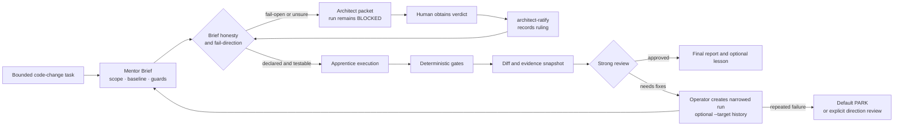

# mentor-loop-engine

**English** · [中文](README.zh.md)

A deterministic reliability harness for AI-generated code changes: a strong model specifies the work, an execution model receives a declared scope, code gates verify narrow invariants, and every decision leaves an audit artifact.

This repository is a runnable research prototype and engineering case study. It demonstrates how to put deterministic boundaries around a multi-model coding loop without treating model confidence, a passing subprocess, or a plausible narrative as proof of correctness.

> **Status:** the engine, 206-test suite, artifact trail, and package verifier are preserved and runnable. The research program is closed and this is no longer the default system architecture. The preregistered A′ measurement design was falsified; cheap-model uplift, cost advantage, and judgment compounding remain **unproven, not disproven**. There is no active product roadmap. The rollback baseline is `mentor-loop-v2-preserved-20260710`.

## Why this is useful

Many agent loops ask a model to plan, edit, and judge its own work. This project separates those responsibilities:

- a Mentor Brief freezes scope, constraints, baselines, and stop conditions before execution;
- an apprentice command receives the declared file blast radius, and out-of-scope changes are blocked before approval;
- deterministic gates check scope and runtime-floor evidence without model judgment;
- a strong reviewer reads the brief, diff, execution logs, verification summary, and gate evidence instead of trusting the apprentice narrative alone;
- fail-open or uncertain guards produce an architect packet and remain blocked until a separate verdict is explicitly ratified;
- repeated-failure history is preserved across related runs; the default outcome is PARK unless an operator explicitly routes a direction review;
- every stage writes durable artifacts under `.mentor-loop/runs/<run-id>/`.

For an engineering or applied-AI reviewer, the 90-second path is:

1. Read the architecture below and the [architecture tour](docs/architecture-tour.md).
2. Inspect the deterministic [blast-radius](gates/blast-radius-check.py) and [runtime-floor](gates/runtime-floor-check.py) gates.
3. Run the 206 tests and [package verifier](tools/verify-package.py).
4. Read the [A′ postmortem](docs/aprime-postmortem.md) for the measurement failure and final research disposition.

## Architecture



The gates deliberately answer narrow questions. The blast-radius gate compares paths reported by Git status with the brief's declared sets. The runtime-floor gate checks changed Python files for `removeprefix` and `removesuffix` against a declared or detected Python floor. Neither gate proves that the new logic is correct, useful, portable in general, or cheaper.

## Evidence ledger

| Claim | Evidence | Status | Boundary |
| --- | --- | --- | --- |
| The engine stages, gates, escalation paths, run identity, and artifact contracts behave as specified | `python -B -m unittest discover -s tests` — 206 tests | `observed` | Repository fixtures and supported test environments |
| The release manifest is internally complete and its wiring is executable | `python -B tools/verify-package.py` — 108 manifest files | `observed` | Package integrity, not user value |
| The two deterministic gates enforce their documented narrow invariants | Gate unit tests and runtime smoke checks | `observed` | Git-status path membership plus two Python API/floor checks; not semantic correctness |
| Historical author-run cases suggest the artifact trail can expose missed scope and review failures | Dated experiments, reports, and postmortems | `proxy` | Small, author-run, and confounded; no third-party engine cold-start |
| The loop improves model quality, delivery speed, cost, or user outcomes | No trustworthy comparative pilot completed | `not-yet-observable` | Further product-level validation is not being pursued |
| The A′ measurement design was structurally unable to measure the intended compounding effect | Preregistered harness plus two independent adjudications | `observed` | The measurement design was falsified; the underlying thesis was not tested |

Tests are evidence for covered engineering behavior. They are not evidence of product superiority or cost arbitrage.

## Quick start

Requirements: Python 3.10+, a clean target Git worktree, and a configured model CLI. The shipped config uses `codex exec`; copy [`mentor-loop.config.json.example`](mentor-loop.config.json.example) and pin explicit models for your environment.

Verify the package first:

```powershell
python -B -m unittest discover -s tests
python -B tools\verify-package.py
```

Create a run:

```powershell
python tools\mentor-loop.py init --repo path\to\target-repo "fix <bounded bug>"
```

The engine returns a create-only run ID and writes the prompt bundle under `.mentor-loop/runs/<run-id>/`. Before continuing, the GUI mentor must run the baseline and write:

```text
.mentor-loop/runs/<run-id>/mentor-brief.md
```

Then run the execution and evidence stages:

```powershell
python tools\mentor-loop.py brief-check --repo path\to\target-repo --run <run-id>
python tools\mentor-loop.py apprentice  --repo path\to\target-repo --run <run-id>
python tools\mentor-loop.py gates       --repo path\to\target-repo --run <run-id>
python tools\mentor-loop.py snapshot    --repo path\to\target-repo --run <run-id>
```

Pause again. A strong reviewer reads the brief, execution logs, verification summary, diff, and gate output, then writes:

```text
.mentor-loop/runs/<run-id>/review.md
```

Only then complete the lesson/report stages:

```powershell
python tools\mentor-loop.py capture-lesson --repo path\to\target-repo --run <run-id>
python tools\mentor-loop.py report      --repo path\to\target-repo --run <run-id>
```

See [`quickstart.md`](quickstart.md) for the GUI mentor, one-shot, Claude Code, and manual paths. See [`operator-runbook.md`](operator-runbook.md) for architect ratification and repeated-failure handling.

## Engine and skill

The [mentor-loop skill](https://github.com/ivalainexii/mentor-loop) and this engine package the same methodology on different substrates. They are siblings, not versions.

| | `mentor-loop` skill | `mentor-loop-engine` |
| --- | --- | --- |
| Runtime | Claude Code skill + subagent | Python CLI driving configured commands |
| Entry point | `/mentor-loop <task>` | `python tools/mentor-loop.py ...` |
| Best fit | Interactive in-session use | Scriptable stages, fixtures, and audit tooling |

## Repository map

- [`tools/mentor-loop.py`](tools/mentor-loop.py) — stage engine and run-state transitions.
- [`gates/`](gates/) — deterministic blast-radius and runtime-floor gates.
- [`tests/`](tests/) — 206 unit tests for stages, gates, identities, and escalation paths.
- [`tools/verify-package.py`](tools/verify-package.py) — manifest, wiring, gate, test, and optional zip verification.
- [`docs/architecture-tour.md`](docs/architecture-tour.md) — control flow and artifact walkthrough.
- [`operator-runbook.md`](operator-runbook.md) — failure review, architect decisions, and operator recovery.
- [`evals/`](evals/), [`experiments/`](experiments/), [`reports/`](reports/) — preserved raw research material; dated notes may be superseded by this README.
- [`evidence-index.md`](evidence-index.md) — map from public claims to repository evidence.

## What this repository does not claim

- It does not prove that a cheaper model performs closer to a stronger model.
- It does not establish a cost advantage, compounding judgment effect, or improved user outcome.
- A clean blast-radius result does not prove semantic correctness.
- It is not a sandbox, IAM system, or substitute for provider and operating-system permissions.
- The engine has no independent third-party cold-start; development and testing were Windows-first.
- Historical experiment notes are provenance, not an active roadmap or a source of stronger current claims.

## License and provenance

Original code and documentation are available under the [MIT License](LICENSE). See [THIRD_PARTY_NOTICES.md](THIRD_PARTY_NOTICES.md) for public issue material and upstream attribution. Do not include credentials, private source, customer data, or exploit details in public reports.
