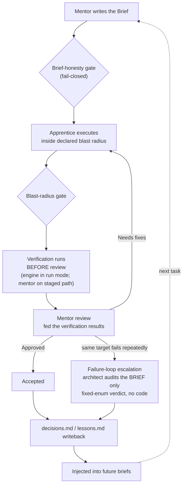

# Architecture Tour

`mentor-loop-engine` is a discipline loop that lets a cheap model execute work under
a strong model's brief, inside a scope it declared in advance. Deterministic code —
not model judgment — checks that scope before a strong review ever reads the diff.
When the same piece of work fails repeatedly, the loop stops retrying blind and
routes to an architect audit of the brief itself, not another patch attempt.

## The loop, end to end



A few things this diagram is deliberately precise about:

- **The brief-honesty gate is fail-closed.** Every guard in a Mentor Brief must
  declare which way it fails and why; a guard left fail-open or unsure is routed to
  an architect *before* the apprentice ever runs (see README, "Why you'd want it").
- **Verification runs before review, not after.** In the one-shot `run` pipeline the
  engine executes the brief's verification commands itself and feeds the output into
  the review prompt (`run --verification`); on the staged path, the mentor runs them
  before writing the review. Either way, the review never signs off on a diff while
  hoping the tests pass later.
- **The failure-loop escalation only fires on repeated failure of the same target**,
  and it is scoped to *direction*, not code: the architect returns one of a fixed set
  of verdicts, and a verdict containing a code block, diff marker, or `file:line` edit
  is rejected outright rather than laundered into something executable
  (`operator-runbook.md`, "Failure-Review Loop").
- **The writeback loop is what the "compounding" thesis rests on**, and — see
  "Honest boundaries" below — that thesis is explicitly not yet established.

## One task through the loop

This walks the staged CLI path (`operator-runbook.md`, `quickstart.md`) — the same
commands and artifact names the repo itself uses, not a paraphrase.

1. **Start the run.**
   ```powershell
   python tools/mentor-loop.py init --repo path\to\target-repo "fix <bug description>"
   ```
   Creates `.mentor-loop/runs/<run-id>/` plus a prompt bundle: `mentor-brief-prompt.md`
   and `active-lessons.md` (any standing lessons that apply, injected up front).

2. **The mentor (strong model) writes the work order.** *(mentor step — no CLI command)*
   The mentor reads the prompt bundle and writes
   `.mentor-loop/runs/<run-id>/mentor-brief.md` — the Context Pack, the runtime/
   dependency constraints, the declared blast radius, the baseline command, the
   verification commands, and the stop conditions.

3. **Validate the brief.**
   ```powershell
   python tools/mentor-loop.py brief-check --repo path\to\target-repo --run <run-id>
   ```
   Runs the brief-honesty gate. If a guard is undeclared or declared fail-open, this
   is where the run stops and escalates to an architect (`architect-packet` /
   `architect-ratify`) instead of continuing. An optional `brief-review` stage can
   additionally route the brief past a second, different-vendor model for advisory
   findings before the apprentice runs — dormant unless an advisor command is
   configured.

4. **The apprentice (cheap model) executes.**
   ```powershell
   python tools/mentor-loop.py apprentice --repo path\to\target-repo --run <run-id>
   ```
   Produces `apprentice-prompt.md`, `apprentice-log.md`, `apprentice-codex.log`, and
   `apprentice-exit-code.txt`. The apprentice may only touch files inside the brief's
   declared blast radius.

5. **Run the deterministic gates.**
   ```powershell
   python tools/mentor-loop.py gates --repo path\to\target-repo --run <run-id>
   ```
   Writes `gate-blast-radius.txt` and `gate-runtime-floor.txt`. The blast-radius gate
   reads `git status --porcelain`, so an untracked helper file counts as scope drift
   the same as a tracked one.

6. **Snapshot the diff.**
   ```powershell
   python tools/mentor-loop.py snapshot --repo path\to\target-repo --run <run-id>
   ```
   Writes `diff-and-status.txt` — the artifact the mentor's review is scoped to.

7. **The mentor reviews — diff and evidence only.** *(mentor step — no CLI command)*
   The mentor runs the brief's verification commands, then reads the brief, the diff,
   the apprentice log, the gate output, and the verification results, and writes
   `.mentor-loop/runs/<run-id>/review.md` with one of three verdicts: `Approved`,
   `Needs fixes`, or `Stop and re-plan`.

8. **Capture a lesson, if one earned its place.**
   ```powershell
   python tools/mentor-loop.py capture-lesson --repo path\to\target-repo --run <run-id>
   ```
   Appends to `.mentor-loop/lessons.md` only when the review surfaced a reusable
   mistake — not a one-off task detail.

9. **Close the run.**
   ```powershell
   python tools/mentor-loop.py report --repo path\to\target-repo --run <run-id>
   ```
   Assembles `.mentor-loop/runs/<run-id>/final-report.md` from everything above.

If, instead, this *same target* has now failed repeatedly (two recorded failures of
the same target), step 7 (or verification) triggers the failure-loop escalation
instead of a third blind retry: the engine
assembles a failure-attribution packet from the per-attempt history
(`.mentor-loop/state/brief-review-loop.json`) and sends it to the configured
architect command. The architect may return exactly one of six fixed verdicts
(`revised_brief`, `narrowed_task`, `route_change`, `keep_brief_retry`,
`brief_sound_capability_gap`, `park_report`) — never code. If no architect command is
configured, the loop parks rather than guessing (`operator-runbook.md`,
"Failure-Review Loop").

## Receipts

Things stated here are things you can go check in the repo, not summarized from
memory:

- **Tests.** `tests/` ships seven unit-test modules —
  `test_architect_loop.py`, `test_blast_radius_check.py`, `test_brief_honesty.py`,
  `test_brief_review.py`, `test_failure_loop.py`, `test_review_verification.py`, and
  `test_runtime_floor_check.py` — run via `python -m unittest discover -s tests`.
  `README.md` states 149 tests pass this way and that the package self-check
  (`python tools/verify-package.py`) is also green.
- **The postmortem exists and says what it says.** `docs/aprime-postmortem.md`
  documents a preregistered experiment on the compounding-judgment thesis: an
  eleven-run pilot, zero runs reached `accepted`, and the registered metric
  ("correction rounds per accepted task") turned out to be one the single-pass
  harness could not produce at all — caught by two independent adjudications that
  converged on the same finding by different paths. The experiment was closed as
  **uninformative** (zero evidence in either direction), and a redesigned successor
  metric is described in the same document.
- **The honest-status split is the README's own framing, not this document's.**
  `README.md`'s "Honest status: a working tool vs. an open research claim" section
  separates what's established (the loop runs end-to-end and produces the full
  artifact set; the gates are real deterministic code exercised by tests; the guard /
  escalation / architect-loop / failure-review round-trips behave as specified) from
  what's still open (the compounding claim itself).

## Honest boundaries

Carried over from `README.md` without upgrading any of it (that section — "Honest
status: a working tool vs. an open research claim" — is the authoritative copy):

- **The compounding claim is a pre-registered, open measurement — not a finding.**
  It has not cleanly fallen yet.
- **Recent zero-correction datapoints are weak**: the apprentice's slice was nearly
  fully specified from the author's own validated run, not an independent execution.
- **All datapoints are author-run** — no baseline comparison (cheap-model-alone vs.
  full-loop) and no independent third-party run of this engine, including no
  third-party cold start.
- **No cost measurement yet.** Treat this as discipline tooling and a case study, not
  cost arbitrage.
